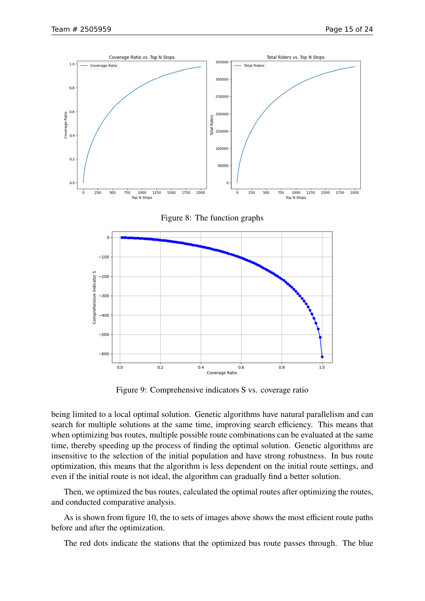

## 研究背景

Francis Scott Key Bridge 坍塌改变了巴尔的摩的交通流分布，也影响居民、企业和公共交通系统。项目目标是从交通重分配、公交线路优化和长期基础设施项目评估三个层面给出量化方案。

## 方法

- 用 K-means 聚类识别交通需求热点与关键节点；
- 建立交通流模型，比较桥梁坍塌前后的空间与时间变化；
- 将公交站点与线路抽象为网络，并以遗传算法搜索路线组合；
- 从经济、环境、出行效率与政府投入等维度构建综合评价指标。

## 我的工作

我主要负责交通流模型、遗传算法公交路线优化以及评价指标整合。模型不只追求覆盖率最大化，还同时考虑拥堵缓解、乘客规模与利益相关者影响，使优化结果能够转化为城市规划建议。

## 成果

项目完成 24 页英文建模论文 *A Roadmap to a Better City*，获 2025 年 MCM/ICM **Honorable Mention（H 奖）**。
