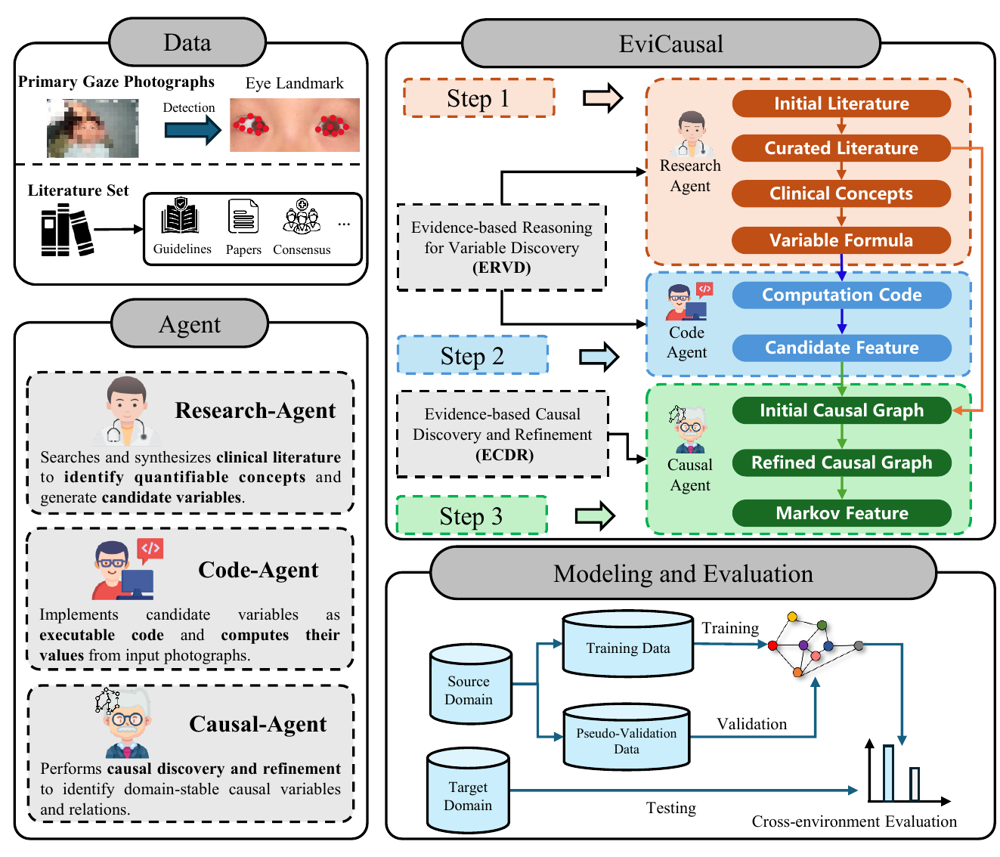
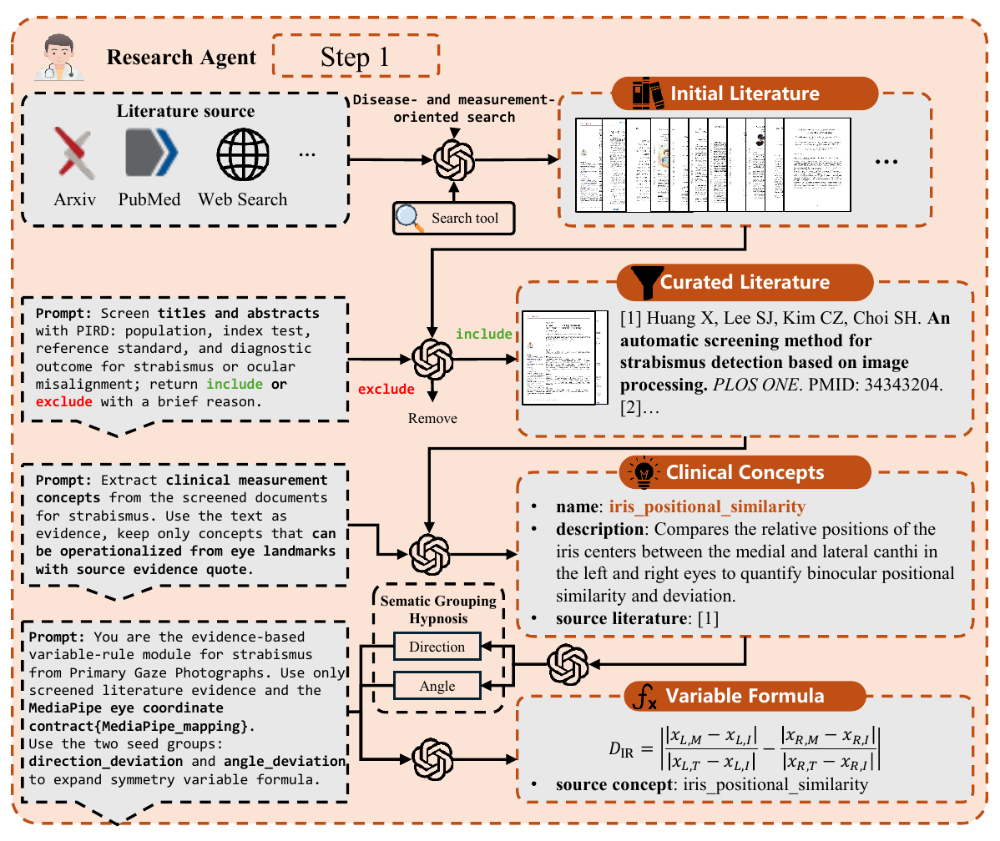
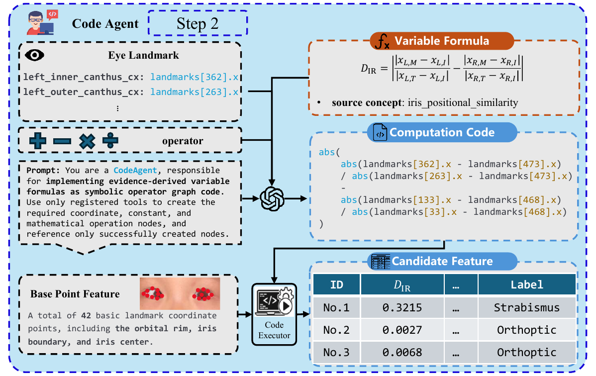
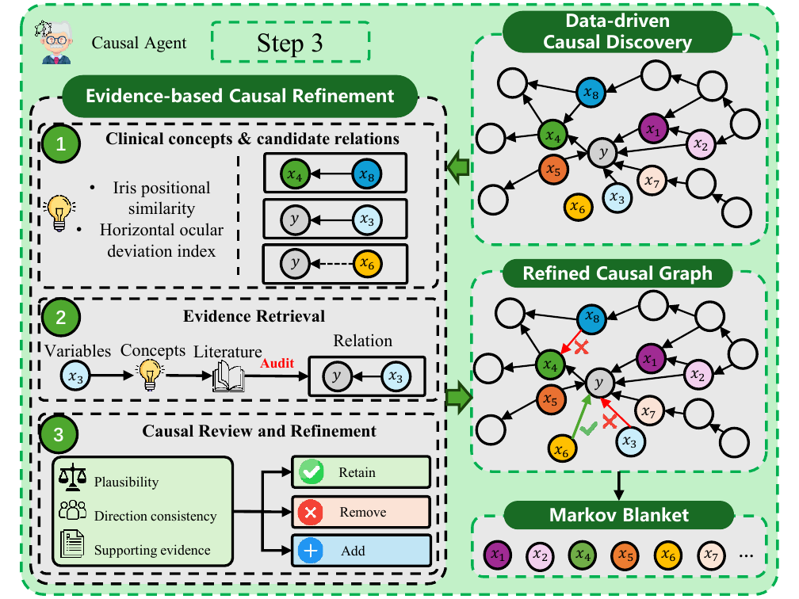

## 项目状态

**AAAI 2027 投稿中 · 第三作者**

EviCausal 面向真实医疗场景中的跨域斜视诊断问题。受采集设备、光照、背景、头部姿态和图像质量影响，在受控医院数据上训练的模型往往难以直接泛化到真实环境。项目尝试将医学文献证据、可解释变量构建和因果结构学习连接起来，减少对环境相关伪特征的依赖。

## 三智能体协作

框架由三个职责清晰、产物可审计的智能体组成：

1. **Research Agent**：检索并筛选临床文献，从指南、论文和临床共识中提炼可量化概念与候选变量；
2. **Code Agent**：把文献支持的变量公式转换为受限算子图和可执行代码，批量计算眼部几何特征；
3. **Causal Agent**：在源域数据上学习初始因果结构，并使用变量语义、公式依赖和关系级临床证据进行审核与修正。

整个流程从文献研究延伸到源域训练、验证与独立目标域测试，同时严格隔离目标域结果，避免测试信息反向参与变量生成、因果发现或模型选择。

### Research Agent：从文献到临床概念

Research Agent 围绕疾病和测量目标检索文献，依次完成标题摘要筛选、临床测量概念提取、证据追踪与变量公式生成。每个候选变量都保留来源文献、语义分组和可操作化依据，使后续代码生成具有可审计的医学起点。

### Code Agent：从公式到候选特征

Code Agent 将证据支持的变量公式映射为受限符号算子图，只允许调用已注册的眼部关键点、常量与数学运算节点。生成的程序经过执行器批量计算，将抽象临床概念转换为可用于因果发现和分类建模的候选特征。

## 两个核心机制

### ERVD：证据驱动的变量发现

Evidence-Based Reasoning and Variable Discovery 从医学证据出发寻找可视、可计算且具有临床含义的眼部测量概念，再将其转化为公式与程序。项目自动发现了 **16 个此前未被公式化的诊断变量**，并由眼科医生评估为具有临床合理性。

### ECDR：证据驱动的因果发现与修正

Evidence-Based Causal Discovery and Refinement 先使用源域数据获得初始结构，再针对与诊断标签相关的因果边进行证据审计。每一次保留、删除或新增关系都保留变量语义、计算来源和文献依据，使最终结构不仅能训练，也能追溯其医学理由。

Causal Agent 对数据驱动的初始图逐边检索临床证据，从合理性、方向一致性和支持证据三个维度决定保留、删除或新增关系，最后提取与诊断标签相关的 Markov Blanket 特征。

## 跨域实验

项目建立了受控临床源域与独立真实环境目标域的跨域评估流程。在开发阶段不访问目标域的条件下，当前结果为：

- 目标域 AUC：**84.0%**；
- 准确率：**85.4%**；
- F1-score：**70.6%**；
- 相对此前最佳结果，AUC 提升 **12.4 个百分点**，F1 提升 **20.2 个百分点**。

## 我的工作

我参与医疗多智能体科研系统的实现与实验复现，重点关注文献证据到可计算变量的转换、因果结构审计、跨域数据契约以及端到端流程的可复现性。项目代码包含主流程、实验注册、数据划分校验、消融实验和离线测试。

## 代码与材料

- [AutoCausalResearch](https://github.com/YifanWang-AI/AutoCausalResearch)（AAAI 双盲评审阶段为私有仓库，暂不对访客公开）

为保护双盲评审与医疗数据隐私，本页仅展示论文中的脱敏流程示意图，不公开匿名稿 PDF、原始患者影像、训练数据和内部实验配置；待评审状态变化后再更新可公开材料。
