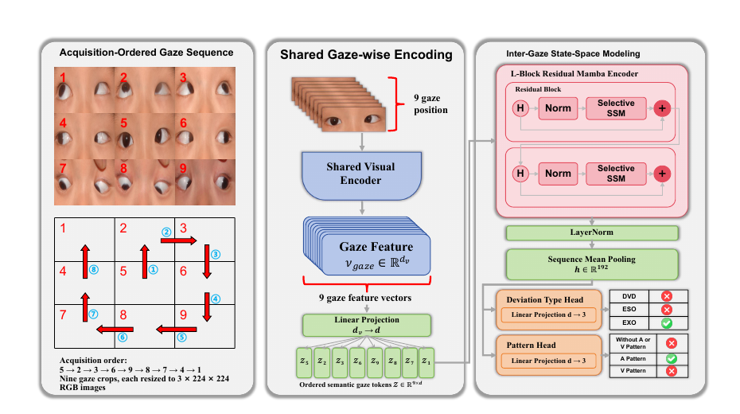
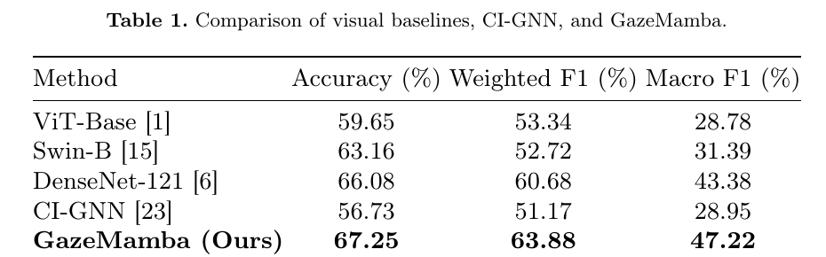
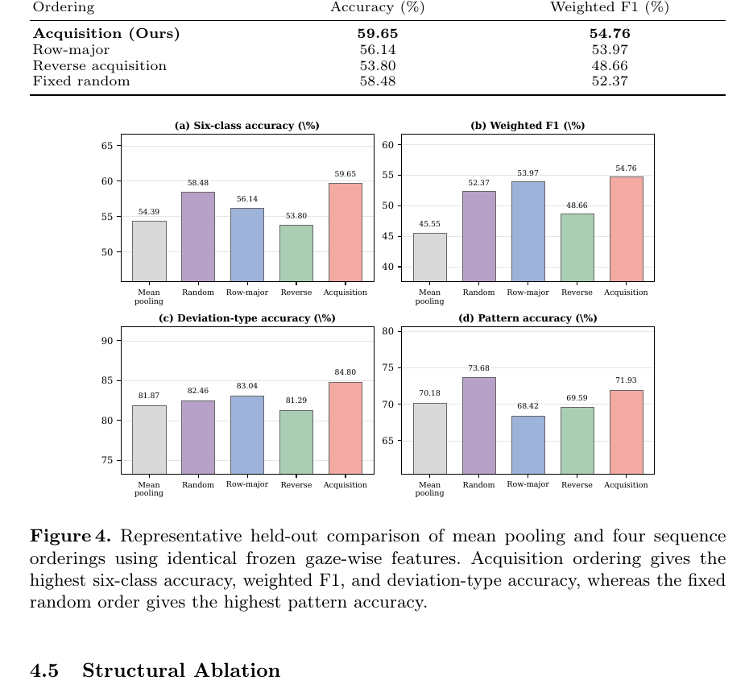

## 项目概述

**面向 ISCiIA 2026 的研究工作 · 第二作者**

九眼位照片通常被作为一张静态合成图进行分类，但斜视亚型的判别信息不仅存在于单个眼位，也体现在患者眼球沿采集轨迹移动时，双眼对齐状态在不同方向上的变化。GazeMamba 将九个完整眼位分别编码为语义 token，并按照真实采集顺序组织为序列，让模型显式学习跨眼位的状态转移。

研究与眼科临床团队合作建立了包含 **1,716 张九眼位照片、6 类斜视亚型**的评估基准，并采用类别分层的 70/20/10 划分：1,202 张用于训练、343 张用于验证、171 张作为独立测试集。模型选择仅依据验证集完成。

## 方法设计

完整框架由三部分组成：

1. **共享眼位编码**：将九眼位合成图切分为九个眼位 crop，由共享 DenseNet-121 提取 1,024 维视觉特征；
2. **采集顺序建模**：按照 `5 → 2 → 3 → 6 → 9 → 8 → 7 → 4 → 1` 的实际采集轨迹排列 token，并使用两个残差 Mamba block 传播跨眼位信息；
3. **双头诊断解码**：分别预测偏斜类型与 A/V pattern，再在六种合法组合中生成最终亚型预测。

与把图像 patch 序列化的常规 Vision Mamba 不同，GazeMamba 的每个 token 对应一个具有明确临床含义的完整眼位。它将“单眼位外观”与“眼位间方向变化”拆开建模，使序列结构直接对应九眼位检查中的状态变化。

## 核心结果

在固定 held-out 测试协议下，论文主模型取得：

- 六分类准确率：**67.25%**；
- weighted F1：**63.88%**；
- macro F1：**47.22%**；
- 相比最强静态合成图基线 DenseNet-121，准确率、weighted F1 和 macro F1 分别提升 **1.17、3.20 和 3.84 个百分点**。

## 顺序与结构消融

在使用完全相同的冻结眼位特征时，Clinical Linear Mamba 相比无序 Mean Pooling：

- 准确率从 54.39% 提升至 **59.65%**；
- weighted F1 从 45.55% 提升至 **54.76%**。

采集顺序在代表性实验中优于行优先、反向和固定随机顺序；不过三随机种子下，它相对行优先顺序的平均准确率优势仅为 0.59 个百分点。因此当前证据更有力地支持“跨眼位顺序建模有效”，而不是证明某一种遍历顺序具有普遍最优性。

Closed-loop、Circular PE、Bidirectional 和 Center-ring 等更复杂结构均未超过简单的线性采集序列，说明在当前数据规模下，更强的结构约束和更大的模型容量容易增加过拟合风险。

## 局限与后续方向

模型在常见的无 A/V pattern 内斜视和外斜视上表现较好，但 DVD 与稀有 A/V pattern 亚型的召回率仍然有限，macro F1 也明显低于 weighted F1。后续工作将重点关注类别均衡、代价敏感学习、多中心验证，以及对轻量 MobileNet 分支和探索性六分类头进行更充分的多随机种子检验。

## 我的工作与代码

作为第二作者，我参与了九眼位序列建模、基线与消融实验、结果核查及可复现研究材料整理。公开仓库包含静态视觉基线、时序有效性、顺序与结构消融、多随机种子验证、轻量模型、临床混淆矩阵及去标识化的实验清单。

- [Vision-Mamba-Experiments](https://github.com/kevvy-pixel/Vision-Mamba-Experiments)

为保护医疗数据隐私，仓库不包含原始患者图像、模型 checkpoint 或缓存特征；发布版样本标识与日志路径已完成去标识化处理。
