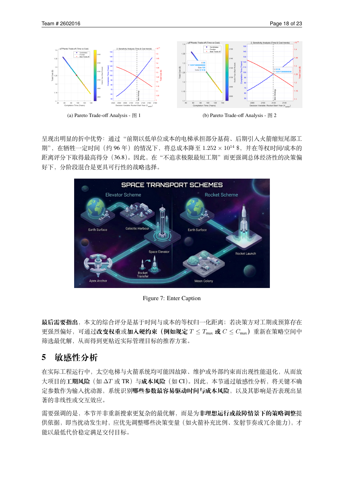

## 建模任务

2026 年美国大学生数学建模竞赛 B 题要求为大规模月球殖民物资运输设计可持续方案。我们提出 **HELMS（Hybrid Earth–Lunar Mobility System）**，在年度离散时间尺度上统一模拟太空电梯与火箭系统。

## 核心方法

- 依据轨道比机械能匹配与后续修正 Δv 最小化，推导并优化电梯释放高度；
- 用差分进化算法处理轨道非线性约束；
- 通过 NSGA-II 获得时间、成本与全生命周期碳排放的三维 Pareto 前沿；
- 使用 Morris 方法识别影响工期与成本风险的关键不确定因素。

## 关键洞察

纯电梯方案成本低但工期长，纯火箭方案速度快但代价高。分阶段混合策略采用“电梯承担基荷、火箭加速尾部交付”，形成更具工程可行性的折中。环境分析还显示：当供电碳强度低于约 **100 gCO₂/kWh** 时，电梯路线的全生命周期排放才稳定低于火箭运输。

## 成果

项目获 2026 年 MCM/ICM **Honorable Mention（H 奖）**。我的工作聚焦模型构建、多目标求解、敏感性分析与工程解释。
