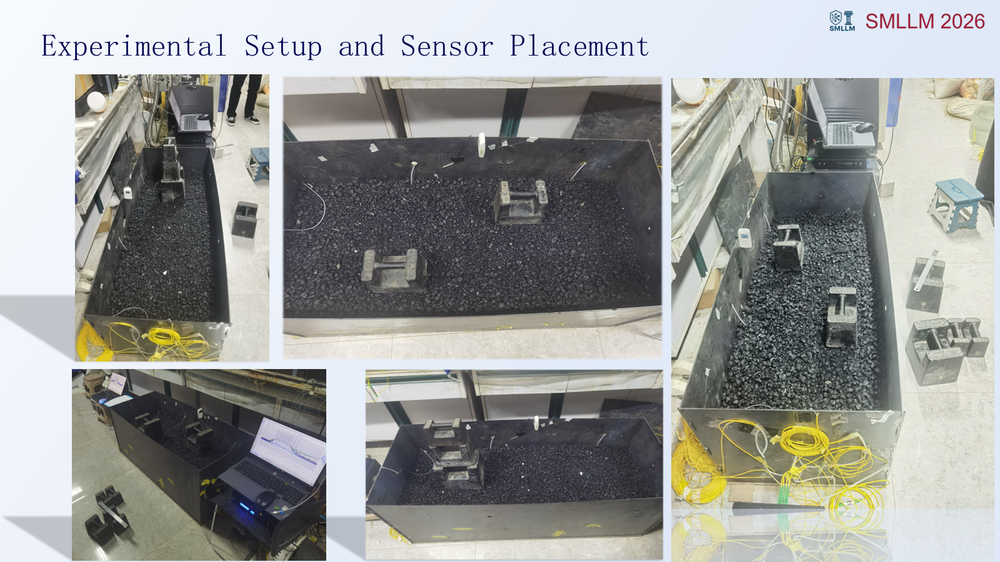
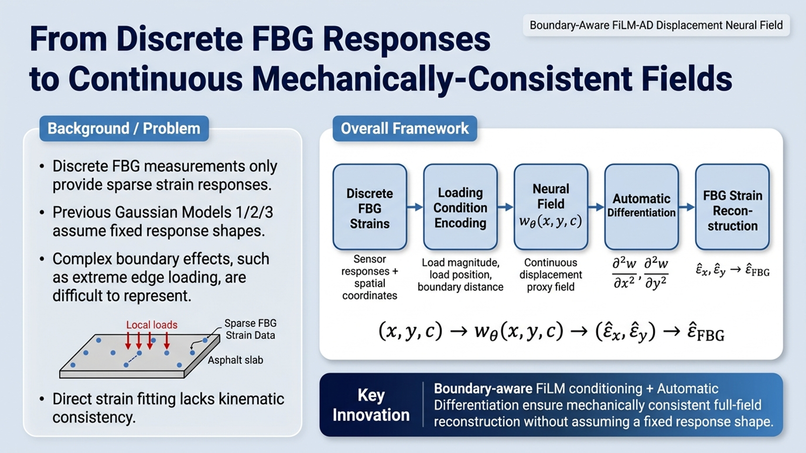
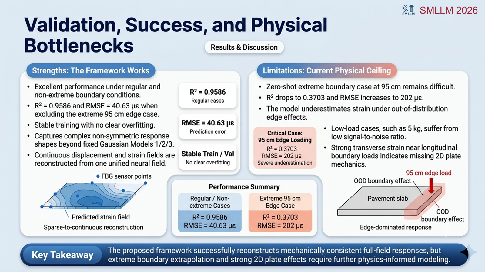

## 项目概述

道路内部病害与不均匀沉降通常难以依靠表面巡检提前识别。本项目利用埋入式 **FBG（光纤布拉格光栅）传感网络**采集多工况应变响应，研究如何从稀疏、离散的传感数据反演连续路面响应场，并为道路塌陷风险识别提供可解释的物理量。

我作为核心成员，负责数据处理、反演算法设计、神经场建模、MATLAB 实现与实验分析。项目已形成从实验采集、温度补偿、响应建模到连续场重构的完整技术链路。

## 方法框架

项目先使用基线校正、噪声阈值和温度补偿获得稳定的 FBG 纯应变信号，再逐步构建响应反演模型：

1. **FBG 数据预处理**：完成多通道同步、基线漂移修正、RMS 噪声量化与响应矩阵构建；
2. **物理响应建模**：结合 Timoshenko 梁与 Pasternak 双参数地基模型，描述路面剪切变形与土体相互作用；
3. **经验响应反演**：使用二维高斯模型、边界修正与联合参数辨识，获得响应中心、扩散宽度及层间传递特征；
4. **运动学约束神经场**：以连续位移代理场为基础，通过二阶自动微分得到应变，并与 FBG 观测对齐；
5. **工况与边界条件编码**：通过 FiLM 条件化、载荷位置及边界距离特征，使统一模型适应不同载荷和非对称边界效应。

## 模型迭代

公开代码保留了从直接响应 MLP 到边界感知 FiLM-AD 神经场的完整演化路径。最终选择的主模型为 **Step19 Boundary-Aware FiLM AD-DNF**：

- 坐标神经网络表示连续位移代理场；
- 自动微分提供运动学一致的应变监督；
- FiLM 根据载荷大小、位置、类型和边界条件调制空间分支；
- 边界距离特征与适度样本加权改善跨工况泛化；
- Step21 边界残差专家作为负向消融保留，没有以局部改进换取整体性能下降。

## 结果与局限

在当前实验数据上，主模型取得：

- 全部工况 \(R^2 = 0.9164\)；
- 排除 95 cm 极端边界工况后，\(R^2 = 0.9586\)；
- 非极端边界工况 RMSE 为 \(40.63\,\mu\varepsilon\)。

模型能够重构常规及多数非对称工况下的连续响应，但 95 cm 极端边界外推仍是主要瓶颈（\(R^2 = 0.3703\)，RMSE 为 \(202\,\mu\varepsilon\)）。这表明后续仍需引入更完整的二维板力学与边界物理先验。

> 神经场输出是由 FBG 应变约束得到的位移代理场，并非直接测得的绝对位移。绝对位移标定仍需要 LVDT、DIC 或独立位移传感器。

## 阶段成果

- 受邀在香港理工大学 **SMLLM 2026 国际研讨会**报告 *FBG-Based Pavement Response Inversion With a Kinematics-Constrained Neural Field for Early Sinkhole Warning*；
- 论文 *FBG Sensor Network-Based Structural Response Modeling and Parameter Identification of Multi-layered Asphalt Pavements* 已投稿至 *Sensors and Actuators: A. Physical*，处于同行评审阶段；
- 完成可复现的 MATLAB 模型演化、数据契约检查与消融实验代码。

## 代码

- [fbg-pavement-neural-field-inversion](https://github.com/kevvy-pixel/fbg-pavement-neural-field-inversion)

实验数据因授权限制未随代码公开；仓库提供模型脚本、数据格式说明、模型演化记录与复现实验入口。
