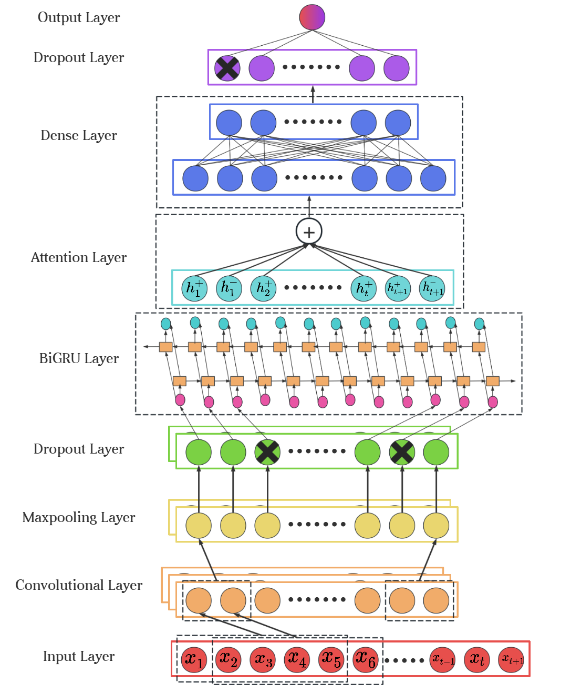
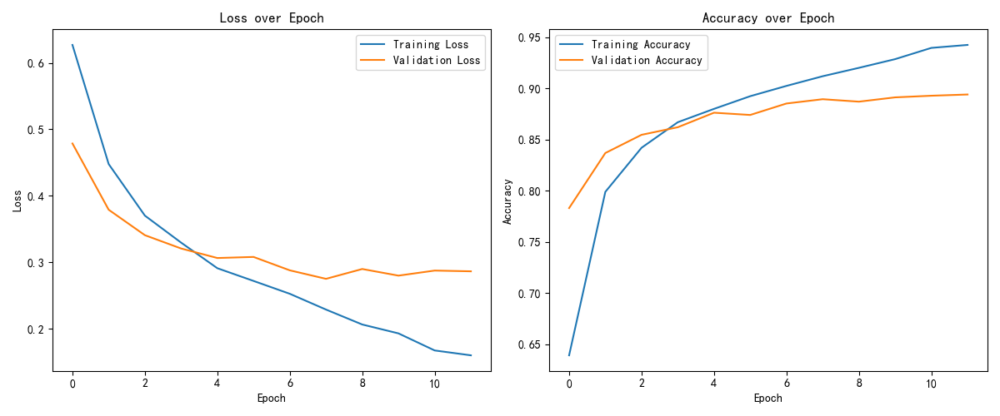
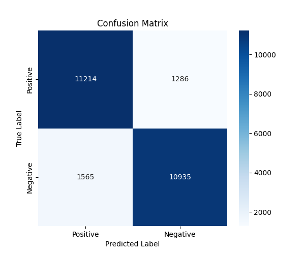

## 研究问题

电影评论情感分类既需要捕捉局部关键词，也需要理解跨句上下文。本研究使用 IMDb Reviews 公开数据集，设计 **CNN-BiGRU-Attention** 混合架构，在特征抽取效率与序列语义表达之间取得平衡。

## 模型设计

- **GloVe Embedding**：利用预训练词向量改善语义初始化；
- **CNN**：提取局部 n-gram 特征并压缩冗余；
- **Bidirectional GRU**：同时编码前向和后向上下文；
- **Attention**：对影响情感极性的关键片段进行加权；
- **正则化策略**：组合 Dropout、学习率衰减和 Early Stopping 控制过拟合。

整体数据流从输入词序列出发，经卷积层提取局部模式、最大池化压缩冗余，再由双向 GRU 汇聚前后文信息。Attention 层对不同时间步的隐藏状态分配权重，最终通过全连接层和 Dropout 输出二分类结果。

## 实验迭代

早期模型训练准确率快速上升，但验证损失在中后期反弹。为此，我逐步减少卷积滤波器和循环单元规模，加入 recurrent dropout 与 L2 正则，并用 `ReduceLROnPlateau` 和早停策略约束训练。最终模型测试准确率达到 **89%**。

## 论文成果

论文 *A Binary Sentiment Classifier for Reviews Based on the CNN-BiGRU-Attention Model* 以第一作者发表于 ICFTIC 会议，并进入 EI 检索。
