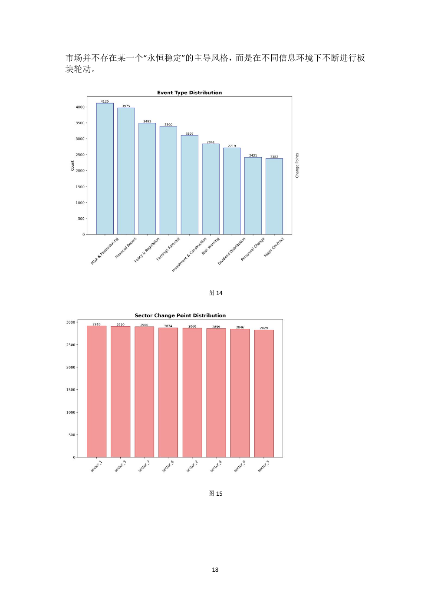

## 问题与目标

传统板块分析往往依赖单一收益相关系数，难以解释公司业务交叉、公告事件和板块风格漂移。本项目以军工相关股票为案例，构建从交易数据到基本面和公告语义的多层联动分析框架。

## 三层分析框架

1. 从收益率、波动率、技术指标与成交量等维度构建综合关联度；
2. 通过谱聚类识别数据驱动板块，并计算股票的动态板块归属因数；
3. 对归属因数跃迁进行财报与公告归因，解释“为什么发生变化”。

## 我的贡献

我主要负责基本面与 NLP 动态归因：对财报指标和板块负载进行高精度时序对齐，结合变点检测锁定公告窗口；自主设计 9 类事件词典与语义强度分类器，将数万条公告映射为可量化的事件信号。

## 结果

模型实现 **92.5% 事件覆盖率**与 **77.6% 时间一致性**（置信度 64%）。项目获得 2025 年“大湾区杯”粤港澳 AI for Science 科技竞赛全国二等奖。
